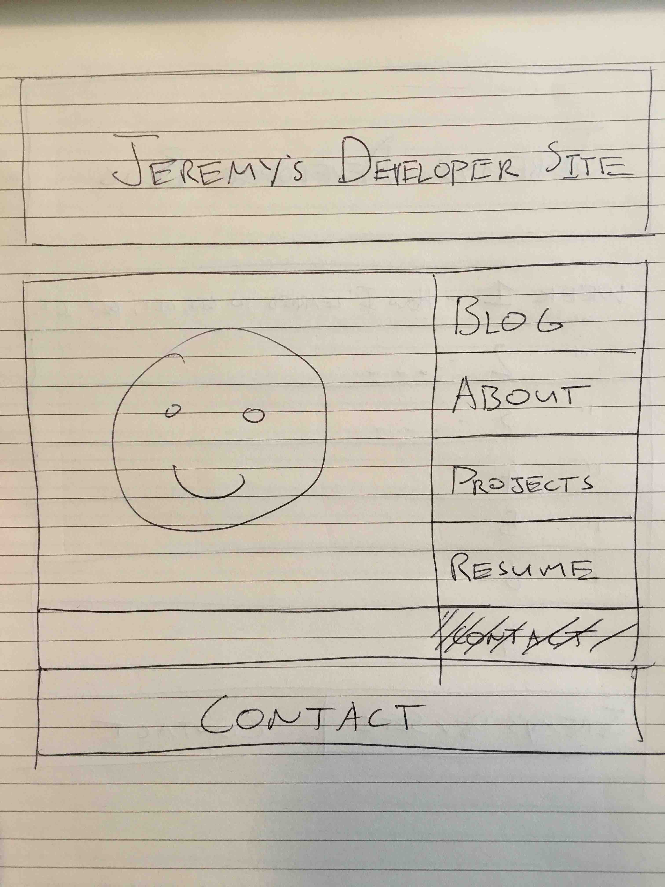
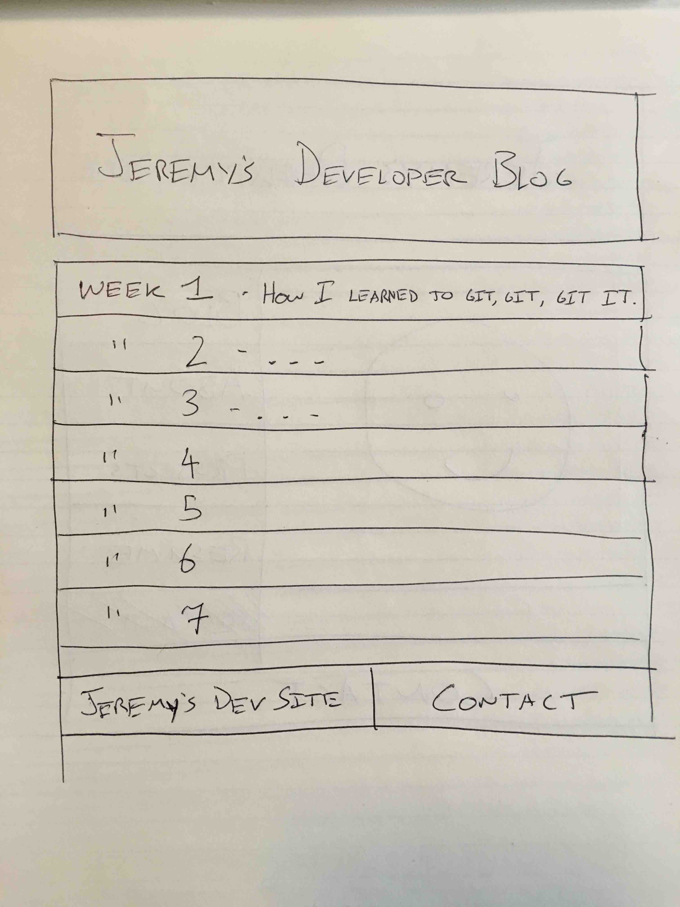

#Wireframe Reflection#

##What is a wireframe?##
A wireframe is a visual representation of what you want your website to look like once it's built. It's kind of like a person's skeleton or a car's drivetrain, except that it's a representation and not part of the actual site.
##What are the benefits of wireframing?##
The benefits is that it organizes your site and helps to understand how your site will look, feel, and operate once it is coded. It makes coding easier as you are able to indentify what will be required.
##Did you enjoy wireframing your site?##
Yes. At first I was unhappy as I am a minimalist and in general I think less is often more. For example, I did not want a footer, and I thought that "About Me" and "Projects" and "Resume" are all basically the same thing. Then after thinking about it a little more, I came to understand the purpose of this site a little bit more. Basically, it is a landing page that links to other useful parts of the site. There won't really be content on this page, it will just be links to content. I then started thinking about it differently, and found a way to make it all work. I think making it visually appealing and easy to understand is the biggest priority.
##Did you revise your wireframe or stick with your first idea?##
Yes, my garbage bin is now full of crumpled up sketches I was unhappy with. I did about eight different sketches.
##What questions did you ask during this challenge? What resources did you find to help you answer them?##
I didn't really understand why I was doing two wireframes and why they are different - why not have the links to each blog post on the index page? I had to re-read the instructions a few times to make sense of it.
##Which parts of the challenge did you enjoy and which parts did you find tedious?##
I enjoyed pretty much all of it and I didn't think it was tedious. If I was forced to use Photoshop or Illustrator instead of doing "Sketch --> Code" then I would have found it tedious.

