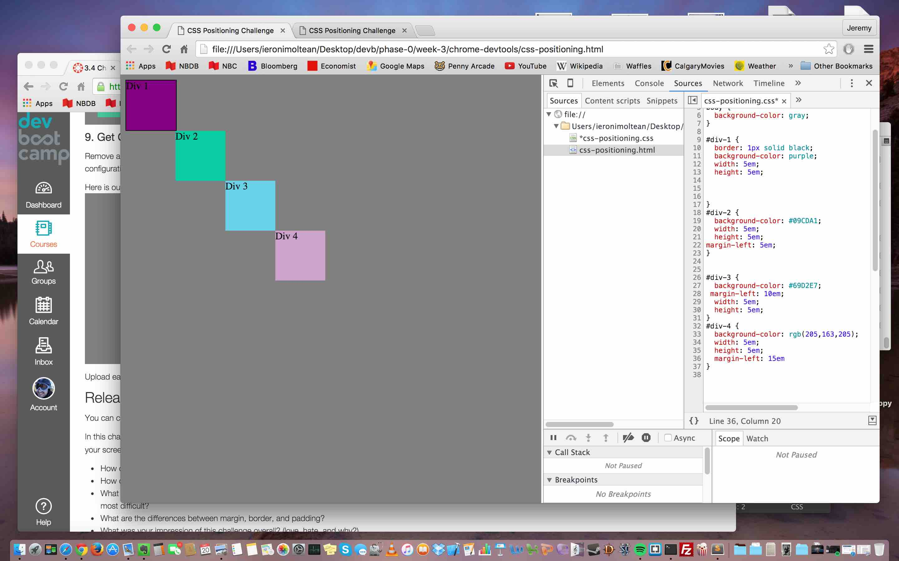

#Reflection 3.4 Chrome DevTools#

##How can you use Chrome's DevTools inspector to help you format or position elements?##

You can change code or add code and see it change the website in realtime. You can make quick changes and see the impact before going into the code and saving changes. If you make major changes you can then copy and paste anything you've done to add to your real code.

##How can you resize elements on the DOM using CSS?##

You go into Elements and Sources in the DevTools screen (right click -> Inspect) and you can select files in the website's directory and add and delete code. Going to sources and switching between html and css I believe is the best way. Otherwise, you would have an html file and a css file and change the elements in css.

You can use background-color, margin, width, and height and position to change the elements position, size, and shape. Using em as a unit of measure is relative, while px is absolute. They are the best two to remember and use, I believe because em will adjust automatically and px is the most exact.

##What are the differences between absolute, fixed, static, and relative positioning? Which did you find easiest to use? Which was most difficult?##

Absolute: are positioned relative to the last element on the DOM.

Fixed: positioned relative to the browser and won't be affected by scrolling.

Static: default state. Vertically stacks elements top to bottom.

Relative: changes to relative position will change it from it's static position.

I think the hardest is figuring out which to use where and then keeping them all consistent, but if you do then it's relatively easy. I actually couldn't really figure out which to use when until I read the reflection criteria, and that really helped.

##What are the differences between margin, border, and padding?##

They're all different ways to add space between elements of the page, in this case the divs, but they all work in subtly different ways. Margin creates a margin between the element and the page, and using percentages is an excellent way to keep everything relative. We primarily used that one of the challenge. Border creates a border around the element, and padding impacts the inside of the element.

##What was your impression of this challenge overall? (love, hate, and why?)##

I loved it, it was great. It was interesting trying to problem solve it with a partner and I feel like we were able to do each challenge pretty well. There are different ways to accomplish the same task, which kind of made it a little difficult at the start.

