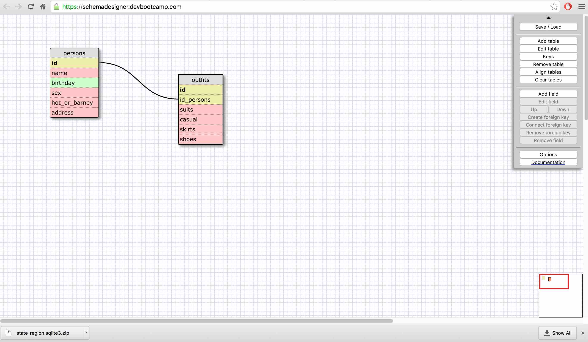

<!--  8.4 Introduction to Database Schemas and SQL -->
<!--
1. SELECT * FROM states;
2. SELECT * FROM regions;
3. SELECT state_name, population FROM states;
4. SELECT state_name, population FROM states ORDER BY population DESC;
5. SELECT * FROM states WHERE region_id = 7;
6. SELECT state_name, population_density FROM states WHERE population_density > 50 ORDER BY population_density ASC;
7. SELECT state_name FROM states WHERE population BETWEEN 1000000 and 1500000;
8. SELECT state_name, region_id FROM states ORDER BY region_id ASC;
9. SELECT region_name FROM regions WHERE region_name LIKE '%Central%';
10. SELECT region_name, state_name FROM states JOIN regions ON states.region_id = regions.id ORDER BY regions.id ASC;

What are databases for?
Databases are for storing large batches of data.

What is a one-to-many relationship?
A one to many relationship is when a number of different elements can be described the same way. For example, everyone on a professional sports team might be one sex.

What is a primary key? What is a foreign key? How can you determine which is which?
The primary key is a key that is the primary way to identify each element in a table. No key can be repeated so that there is a unique key for each element. A foreign key is the primary key of one table set as as a field in another table. It can then link two tables together.

How can you select information out of a SQL database? What are some general guidelines for that?
I guess my advice would be to do the Learn SQL track on codecademy! In general, it goes SELECT thing_you_want_to_select FROM place_you_want_to_select_it_from WHERE thing_you_want > as_big_as_you_need_it_to_be;
Semicolon goes at the end of every statement.

-->