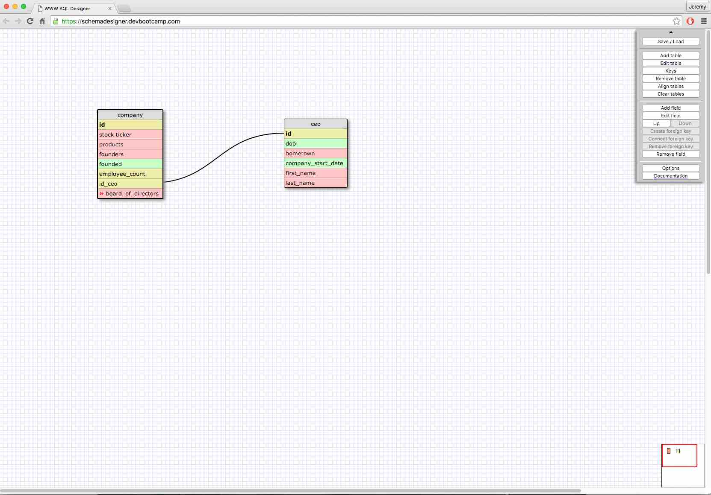
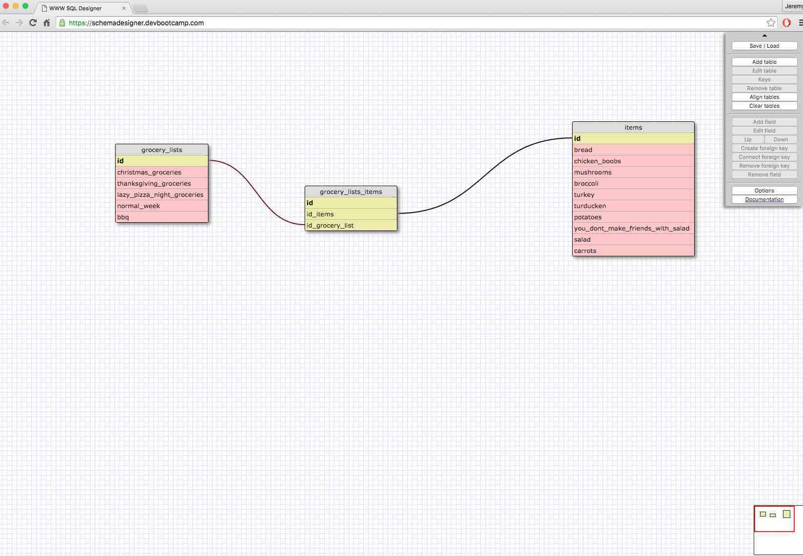

<!-- -->

This relationship is one to one because typically (99.99% of the time) companies only have one CEO, and CEOs are CEO of only one company. Some obvious examples stand out that are different - like Steve Jobs, or Jack Dorsey, or Elon Musk, but usually this is not the case. Regardless, even when someone is the CEO of two companies, a company will only have one CEO. This isn't a perfect example, but I didn't want to copy states and capital cities, and the only one I could come up with was a husband / wife, and that was is kind of lame.

##What is a one-to-one database?##
A one-to-one database is a database where each element is linked to one other element and the other elemented is linked back to it. It's semi hard to come up with examples of this, but here are a few: spouse / spouse; artwork / artist; photograph / photographer; photograph / camera;  company / CEO; country / capital; etc.

##When would you use a one-to-one database? (Think generally, not in terms of the example you created).##
Generally, you would want a one-to-one database any time that two things are linked together. Basically, any time one thing needs another to function and the other way around. Like an ICE car will only have one transmission, and for most people they have a left shoe for every right shoe.

##What is a many-to-many database?##
A many-to-many database is probably the most complex, but it's basically a combination of one-to-one, and one-to-many databases. For example, each F-150 has only one engine. It only has one engine. So the F-150 has a one-to-one relationship with each the engine and the transmission. Ford, the company, makes many cars. So the F-150 has a one to many relationship with Ford - only one company, and it makes many cars. The engines and transmissions inside of each F-150 also have a relationship with Ford, and Ford makes more than just one kind of transmission and engine. So the further you go down the rabbit hole the more relationships you can unravel.

##When would you use a many-to-many database? (Think generally, not in terms of the example you created).##
##What is confusing about database schemas? What makes sense?##
You would use a many-to-many database any time that you have inter-relationships among different elements. It's hard to describe without giving examples. Basically, most one-to-one or one-to-many relationships, if you look at them in a more macro sense, you can find a many-to-many relationship.
